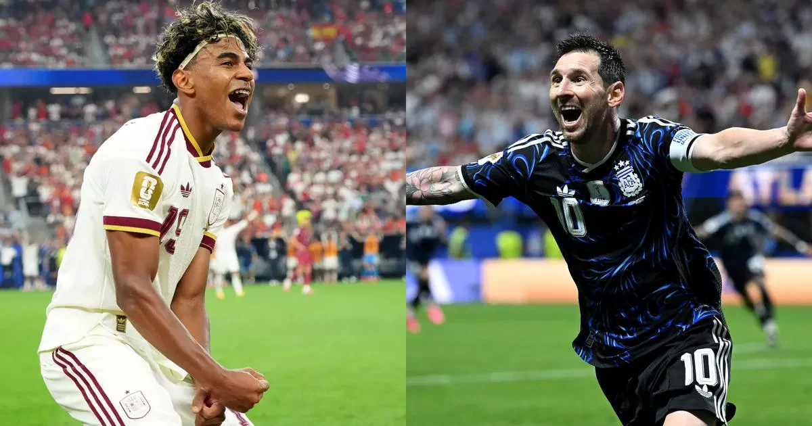

2026年世界杯结束了。西班牙赢了阿根廷，拿到冠军。结果跟我赛前判断差不多。

从第一次看世界杯到现在，二十八年了。

1998年法国那届，我根本不懂什么阵型战术，球员名字也记不住几个。只知道比赛一开始，电视机前突然就热闹了。有人欢呼，有人拍桌子，有人一本正经地分析，好像场上教练听见了就会照他说的换人。

具体看了哪些比赛，早模糊了。但那种气氛记得。足球就是那时候进来的，没什么仪式感。

2002年比较特殊，中国队去了世界杯。三场球，一球没进，一场没赢。但当时没多少人先算这个账，中国队真的站上那个赛场，就已经够全国兴奋一阵子了。那段时间到处都有人聊球，懂球的聊，不懂的也聊。那种很多人同时为一支球队紧张的感觉。。。后来很少再有了。

年轻的时候，凌晨看场球根本不算事，第二天没精神也无所谓。身边还有不少一起看球的人，一边喝酒一边吹牛，好像把我们换上去比赛早赢了。后来参加工作，看球得先想明天几点起。再后来，朋友陆续结婚、生孩子，各自有了各自的生活，能约出来通宵看球的人越来越少。很多比赛，从一群人的热闹，变成一个人的直播。有时候比赛还没结束，自己先睡着了。

不是球不好看了。是人的精力、生活、心境，全都不一样了。

说回这届。坦率的讲，阿根廷能一路打进决赛，我有些意外，踢得并不好看，有些比赛甚至相当难看。但足球就这样，漂亮不一定赢，场面占优也不一定能晋级。冠军给西班牙没什么悬念，整届踢下来最稳定，最像一支完整的球队。

不过这些都不是最让我感慨的。这届大概率是梅西和C罗最后一届世界杯了。

从大罗、齐达内、罗纳尔迪尼奥、卡卡、托蒂、皮尔洛，到哈维、伊涅斯塔，再到这俩人。曾经觉得他们会一直踢下去，后来才发现职业生涯其实很短。我们管他们叫传奇，是因为他们已经陪我们走了很长一段人生。与此同时，亚马尔这样的年轻人已经站到了舞台中央。有人离开就有人登场，足球从来不停下来等谁。只是看着新一代冒出来的时候，忽然发现自己已经是老球迷了。

对了，这届世界杯还有个事挺离谱的。我懒得自己研究，把比赛丢给GPT分析，照着它给的比分买。这玩意翻来覆去就三个「万能比分」，2比1、1比1、1比0，管你哪两支队碰上，分析一大圈，最后大概率从这仨里挑一个。还真中过几次，一度让我觉得人工智能看球有点东西。

最后两场我全买了。法国4比6英格兰，直接把前面赢的还了回去，算下来整届亏了大概六百块。我当时威胁GPT，说这六百算它头上。它非常诚恳地道了歉，然后信誓旦旦地说可以带我买股票赚回来。后来它确实推荐了两次，两只都涨得不错。问题是每次我准备买，它又非常谨慎地劝我，「不要着急，再观察一下买点。」

好。好。好。

一观察，涨上去了。再观察，买飞了。所以这届世界杯，我亏了六百块，外加眼睁睁错过两只上涨的股票。

说真的，以前看世界杯，期待的是进球、胜负、冠军。现在看世界杯，看到的越来越多是时间。小时候觉得四年很长，长到下一届遥不可及。现在觉得四年很快，快到好像上一届决赛才刚结束。

四年以后我大概还是会关注。不会场场看完，也不会再为谁彻夜不眠。但碰到喜欢的球队，还是会停下来看看，遇到一个漂亮的进球，还是会忍不住叫一声好。

世界杯没有变，足球也没有离开。只是当年电视机前那个少年，已经坐到了时间的另一边。
