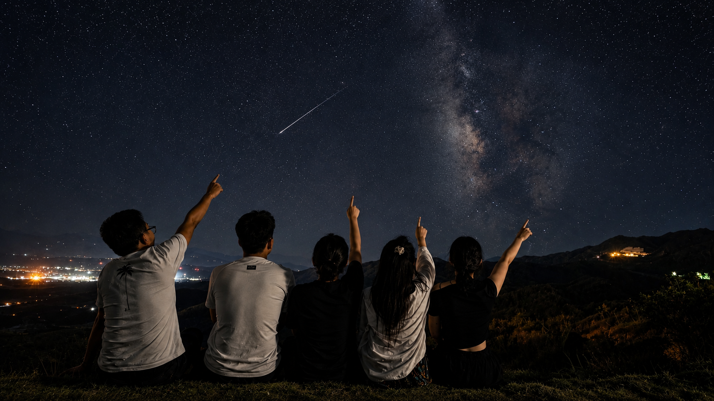

很多天前，就看到媒体说 8 月 13 日凌晨会有一场流星雨。当时我把消息发到群里，结果一个响应的都没有。

到了今晚，大家喝完酒，各自回家。我还开玩笑让那两个正在谈恋爱的朋友去看，结果他们没兴趣，我自己其实也已经懒得折腾了。

后来不知道是谁又把这件事提了起来，而且越说越认真。一个朋友干脆开车，从家里把我们一个一个接出来。原本都准备睡觉的人，又重新出了门。最后凑齐六个人，也没做什么详细攻略，只想着找个远离灯光、视野开阔的地方。

一路转到山上才发现，今晚出来看星星的人还真不少。路边停了很多车，黑漆漆的山里反而比平时热闹。

我们当然也谈不上什么专业装备，每个人就是一部手机。我出门的时候顺手带了个三脚架，本想着至少拍夜景时能稳一点，后来倒真派上了用场。

其实出发之前，我已经在抖音直播间里看了不少现场画面。真正站到山上以后，感觉还是完全不同。大家一边聊天，一边盯着天空，时不时就有人突然喊一句：“看到了！”

接着所有人一起抬头。

有的亮得很明显，一下就从夜空划过去；有的只是一闪，等反应过来已经消失了。今晚出现的频率比平时高得多，所以也没有想象中那么难等。

我们本来主要就是来看，拍照反而是顺带的。结果手机架在那里拍着，后来翻照片才发现，竟然无意中留下了不少划过天空的亮线。更巧的是，有一段大家随便唱歌时录的视频，竟然也刚好把那一瞬间录了进去。

我以前已经看过很多次这样的天象，所以对我来说并不是第一次。但对其中几个朋友来说，却是第一次真正半夜跑到山上，等着天空突然亮起一道光。

看他们每次发现以后兴奋地喊，我反而觉得挺有意思。

可能今晚真正让我开心的，也不是究竟看到了多少颗。

我们这群人很多都是从小一起长大的。到了现在，还能因为很多天前群里一条没人响应的消息，在喝完酒后的凌晨突然重新起意，然后六个人从各自家里被一个一个接出来，一起跑到山上吹风、聊天、拍照、抬头看天，这件事本身就已经很难得。

以后这样的天象还会有，我应该也还会再看。

但今晚不太一样。

不是因为天空有多特别，而是身边刚好还是这些人；有人愿意半夜开车来接，有人愿意临时从家里出来，最后大家真的凑到了一起。

原本只是群里一条没人搭理的消息，最后却变成了一个挺值得记住的凌晨。

照片拍到了，视频也录到了。

而比这些更好的，是那一晚，我们六个人都在。