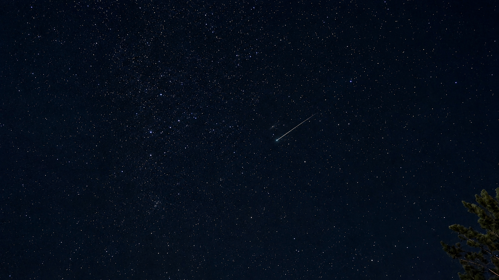
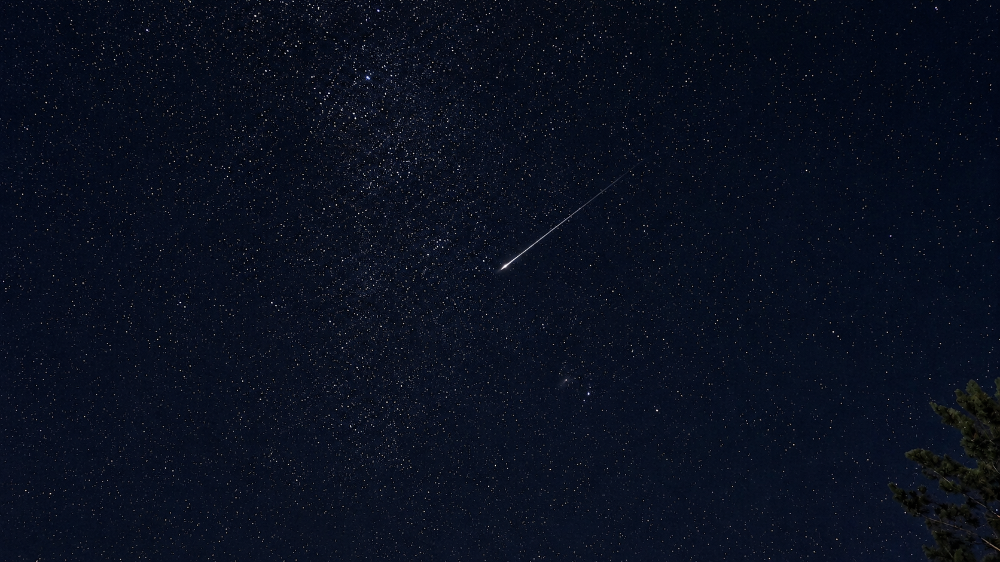
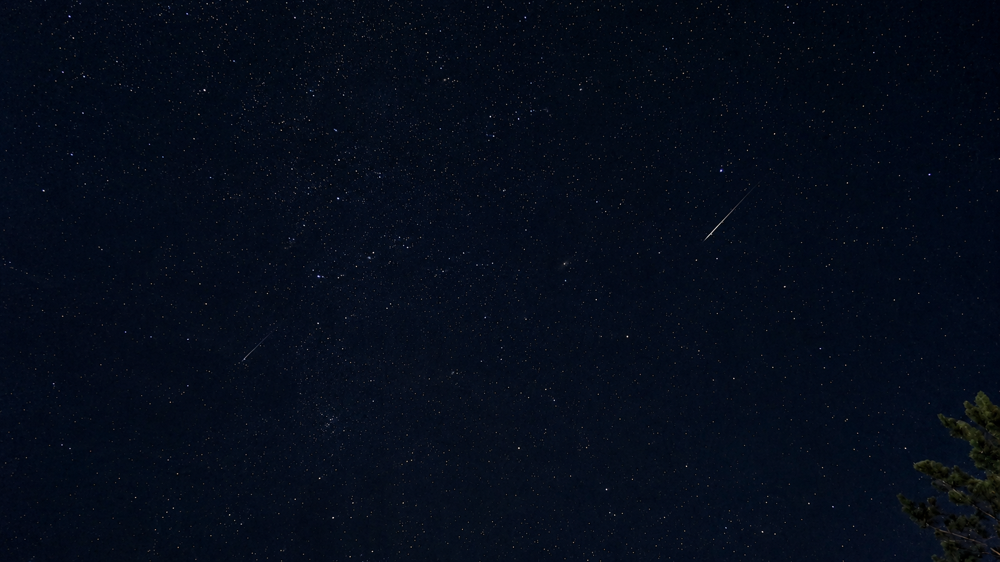
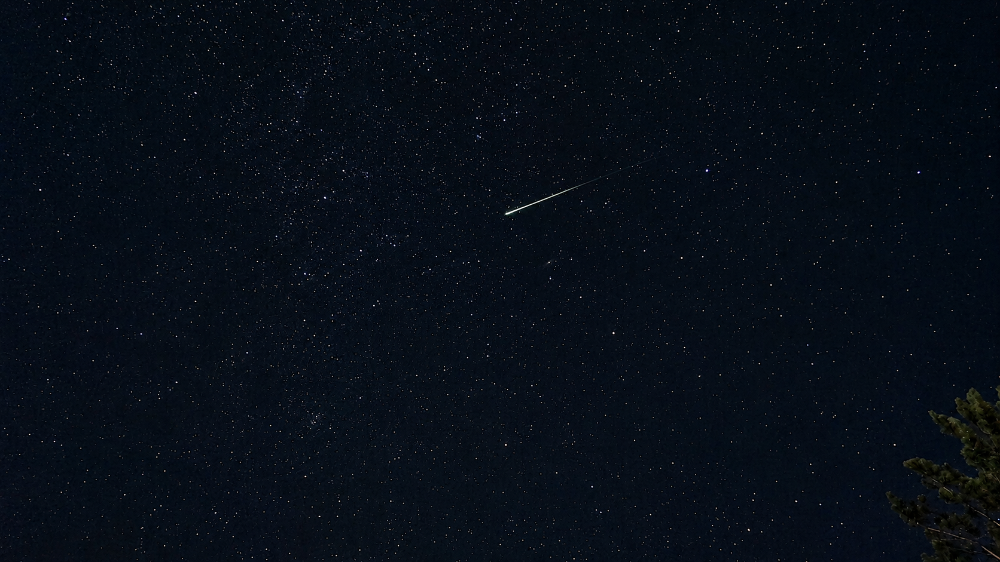

很多天前，我就看到消息说，8 月 13 日凌晨会有一场流星雨。当时我把消息发到群里，结果一个响应的都没有。

到了这天晚上，大家喝完酒，各自回家。我还开玩笑让那对正在谈恋爱的朋友去看，当时自己其实也已经懒得折腾了。

回到家后，我上楼顶看了一眼。抬头就能看到不少星星，我觉得今晚大概真能等到流星，于是又在群里提了一句。刚才一起喝酒的一个朋友忽然来了兴趣，越聊越认真。最后，那对正在谈恋爱的朋友开车把我们一个个接了出来。原本准备睡觉的人又出了门。我们没做什么攻略，只想找个远离灯光、视野开阔的地方。

车一路开到山上，我们才发现今晚出来看流星雨的人还真不少。路边停了很多车，黑漆漆的山里反而比平时热闹。

我们没有专业设备，只有各自的手机和我临出门带上的一个三脚架。本想着拍夜景时能稳一点，后来倒真派上了用场。

出发之前，我已经在抖音直播间里看了不少现场画面。等真正站到山上，感觉还是完全不同。大家一边聊天，一边盯着天空。时不时有人先发现，突然拖长声音喊一句，“灰~~！”其他人也跟着一起“灰~~”，然后赶紧往他指的方向看。

有些流星很亮，一下就从夜空划了过去。有些只是一闪，等我们反应过来时已经消失了。今晚流星出现得比平时频繁，等起来也没有想象中那么难。

我们本来主要就是来看，拍照只是顺带。手机架在三脚架上一直拍着，后来翻照片才发现，竟然无意中留下了不少划过天空的亮线。更巧的是，大家随便唱歌时录的一段视频，也刚好把一颗流星划过的瞬间收了进去。

<figure class="photo-gallery">

</figure>

我以前已经看过很多次这样的天象。对其中几个朋友来说，这却是第一次半夜跑到山上，等着天空突然亮起一道光。

看他们每发现一颗就兴奋地喊起来，我也觉得格外有意思。

今晚究竟看到了多少颗，其实没有那么重要。我们几个大多从小一起长大。到了现在，还能因为很多天前群里一条没人响应的消息，在喝完酒后的凌晨重新起意，从各自家里被一个个接出来，一起跑到山上吹风、聊天、拍照、抬头看天，这件事本身就已经很难得。

这样的天象以后还会有，我应该也会再看。可这一晚很难重来。有人愿意半夜开车来接，有人愿意临时从家里出来，最后我们真的凑到了一起。

照片拍到了，视频也录到了。群里那条起初无人回应的消息，也有了一个值得记住的结尾。

今晚，我们几个人都在。
